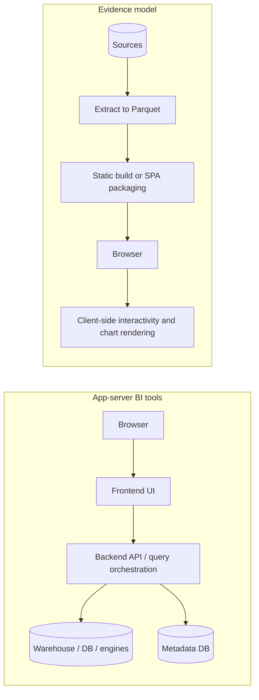

> From: https://chatgpt.com/c/69f716be-2e8c-8328-a8c0-8a1f8b11a45f

# you asked

i need you to compare between the following, see how each one works, the target audience, the architecture, and the capabilities.
and find in thier core what is responsible for rendering the dashbords and charts, and how they are stored and any technical details. This part is technical

---

https://github.com/metabase/metabase
https://github.com/lightdash/lightdash
https://github.com/apache/superset
https://github.com/evidence-dev/evidence

---

# answer

# Comparing Metabase, Lightdash, Apache Superset, and Evidence

## Executive summary

These four projects solve different parts of the BI and dashboarding problem, even though they all produce charts and dashboards. **Metabase** is the best fit when you want a comparatively turnkey BI application with a strong GUI query builder, an internal metadata store, and mature embedding options, but without forcing analysts to adopt dbt or a Git-first workflow. Its core trade-off is that the operational and modeling center of gravity lives inside the Metabase app and metadata database, even though newer YAML serialization/file-based workflows reduce that gap. citeturn6search13turn7search9turn7search5turn6search10turn39search12

**Lightdash** is strongest when dbt already defines the semantic layer and the analytics team wants metrics, dimensions, charts, and dashboards to move closer to code review and Git workflows. It is more “warehouse-native” than Metabase, and more opinionated than Superset, because the semantic model is expected to come from dbt or Lightdash YAML rather than from app-internal modeling alone. Its trade-off is that it is materially less universal than Superset for arbitrary data source/plugin scenarios, and some governance features are explicitly warehouse-driven rather than fully enforced in the BI layer itself. citeturn13view4turn21view2turn21view0turn39search5turn22search10

**Apache Superset** is the most extensible and infrastructure-heavy of the four. It is effectively a BI platform framework: Flask AppBuilder on the backend, React on the frontend, REST/OpenAPI, SQLAlchemy-based database connectivity, a rich visualization plugin ecosystem, and optional Celery/Redis/WebSocket components for scale and async behavior. That makes it the best choice when connector breadth, plugin extensibility, and enterprise-scale control matter more than simplicity. The trade-off is that Superset usually asks for the most platform engineering effort. citeturn29search2turn28search1turn28search0turn28search6turn30search1

**Evidence** is the least like a classic BI server. It is a code-first analytics publishing framework built on SvelteKit and static-site generation, with data extracted into Parquet and interactive components rendered in the browser. That makes it excellent for Git-native reports, customer-facing analytics sites, and documentation-style data products. Its trade-off is that it is not trying to be a live multi-tenant BI control plane in the same sense as Metabase, Lightdash, or Superset. In practice, it is the best authoring/publishing tool of the four, but the weakest fit when you need app-internal governance, built-in role models, or continuously live ad hoc querying from end users. citeturn36search4turn39search19turn38search0turn36search11turn32search2

If you want one sentence per product: choose **Metabase** for broad self-service BI with low modeling overhead, **Lightdash** for dbt-centric semantic BI, **Superset** for maximum extensibility and large-scale self-hosted control, and **Evidence** for analytics-as-code publishing. citeturn39search12turn13view4turn29search2turn36search4

## Comparison at a glance

The most important architectural distinction is that Metabase, Lightdash, and Superset are primarily **application servers with metadata stores**, while Evidence is primarily a **compiled analytics site** that extracts data ahead of time and then renders an interactive static or SPA frontend. citeturn7search9turn13view1turn28search0turn39search19turn38search0



### Architecture, auth, deployment, and storage summary

| Project                                                                                                             | Stack and audience                                                                                                            | Metadata and versioning                                                                                                                                      | Auth and security                                                                                                                                                  | Deployment model                                                                                                                                                                |
| ------------------------------------------------------------------------------------------------------------------- | ----------------------------------------------------------------------------------------------------------------------------- | ------------------------------------------------------------------------------------------------------------------------------------------------------------ | ------------------------------------------------------------------------------------------------------------------------------------------------------------------ | ------------------------------------------------------------------------------------------------------------------------------------------------------------------------------- |
| **Metabase** citeturn6search13turn7search9turn4view0turn4view2turn39search0turn7search5                     | Clojure backend with REST/query processing, React/TypeScript frontend, aimed at broad self-service BI and embedded analytics. | Runtime content lives in the application database; dashboards/questions can also be serialized as YAML for file-based workflows.                             | Built-in permissions plus documented row/column security and impersonation; JWT-based embedding flows are documented.                                              | Officially supports JAR, Docker, and Metabase Cloud; production guidance recommends a real app DB rather than the built-in H2.                                                  |
| **Lightdash** citeturn13view4turn13view1turn17view0turn21view2turn21view0turn39search5turn10search4        | TypeScript monorepo; React/Vite/Mantine frontend and Express/Knex/Postgres backend; aimed at dbt/warehouse-first teams.       | Semantic layer lives in dbt YAML or Lightdash YAML; charts/dashboards can round-trip as YAML via CLI; runtime metadata uses Postgres.                        | Password and SSO are documented; embedding uses JWT; row filtering is primarily implemented with `sql_filter` plus user attributes.                                | Official cloud and self-hosted deployment are both documented; self-hosting centers on Docker/Kubernetes and Postgres.                                                          |
| **Apache Superset** citeturn29search2turn28search1turn41view0turn41view2turn39search2turn29search13         | Python/Flask AppBuilder backend plus React frontend and plugin packages; aimed at extensible enterprise BI/data exploration.  | Dashboards and charts live in the metadata database using JSON-bearing model fields such as `position_json`, `json_metadata`, `params`, and `query_context`. | AuthN/AuthZ is handled by Flask AppBuilder; documented defaults include DB, LDAP, and REMOTE_USER, with rich role/permission controls and row-level security APIs. | Official docs focus on self-hosted Docker/Kubernetes/managed infra patterns; no ASF-operated cloud offering is documented.                                                      |
| **Evidence** citeturn36search4turn35view1turn34view3turn38search0turn39search19turn36search13turn37search8 | SvelteKit/Svelte/Vite analytics publishing framework for SQL-and-markdown data products.                                      | Pages, queries, components, and plugin config are file-based and Git-native; data sources are extracted to Parquet.                                          | No comparable built-in BI role system is emphasized in the reviewed docs; auth is usually delegated to the hosting platform or network edge.                       | Default output is a static site; SPA mode is optional; official docs cover many static/self-hosted targets like GitHub Pages, Netlify, Vercel, Firebase, and Azure Static Apps. |

### Rendering, chart pipeline, and extensibility summary

| Project                                                                                                         | Interactive rendering path                                                                                                                    | Charting stack                                                                                    | Real-time / async behavior                                                                                                                                      | Extensibility posture                                                                                                                                  |
| --------------------------------------------------------------------------------------------------------------- | --------------------------------------------------------------------------------------------------------------------------------------------- | ------------------------------------------------------------------------------------------------- | --------------------------------------------------------------------------------------------------------------------------------------------------------------- | ------------------------------------------------------------------------------------------------------------------------------------------------------ |
| **Metabase** citeturn4view0turn4view2turn9search15turn7search2turn7search6turn8search3                  | Primarily client-side rendering in the React app; static export/subscription paths generate PNG/PDF outputs separately.                       | ECharts is present in frontend dependencies; frontend uses RTK Query for API fetch/caching.       | Caching, automatic cache refresh, alerts, subscriptions, and model persistence are documented; first-class streaming was not surfaced in the reviewed material. | Strong driver/plugin model for databases and mature embedding SDK; custom viz extension is less central than in Superset.                              |
| **Lightdash** citeturn13view1turn18view0turn25view2turn22search3turn22search10turn21view4               | Client-side React rendering with centralized visualization state and ECharts config generation; custom visualizations can use Vega/Vega-Lite. | ECharts is the default chart stack; `react-vega` is used for custom visualizations.               | Async SQL Runner jobs, caching, and scheduled pre-aggregates are documented; push-style streaming is not a primary documented feature.                          | Strong on embedding and content-as-code; weaker than Superset for broad plugin ecosystems, but stronger than Metabase for Git-backed content.          |
| **Apache Superset** citeturn28search1turn28search5turn30search10turn28search6turn30search1turn29search3 | Charts are rendered client-side through frontend plugin packages after backend query orchestration via chart/data APIs.                       | Modern chart stack is heavily ECharts-based, with broader plugin support across packages/plugins. | Async queries can use Celery and optionally WebSockets; polling is also part of the async story.                                                                | This is the most extensible visualization platform of the four, with dedicated chart plugin packages, extension tooling, and a public OpenAPI surface. |
| **Evidence** citeturn36search11turn36search1turn39search19turn38search2turn32search2turn36search13      | Default production path is static generation; charts still render in-browser, and client-side interactivity works on shipped data/assets.     | ECharts for charts, Leaflet for maps, Shadcn for UI, plus custom Svelte components.               | Not a live query server by default; refresh is typically rebuild-driven, with SPA mode available when needed.                                                   | Very strong plugin and component model for developers comfortable with Svelte, but not a runtime BI plugin platform in the Superset sense.             |

## Metabase

### What it is and who it serves

Metabase positions itself as an open-source BI platform for asking questions, building dashboards, and embedding analytics in applications. In the official developer docs it is described as a two-part application with a **Clojure backend** and a separate frontend, which makes its design feel like a classic integrated BI server rather than a report compiler or a semantic-layer shell. That makes it especially suitable for mixed analyst/business audiences who want a GUI-first experience and for product teams that need embeddable dashboards without requiring a dbt-first workflow. citeturn6search13turn7search9turn39search12

### Architecture, rendering, and storage

On the backend, Metabase’s query processor translates its internal query language, **MBQL**, into native query languages such as SQL, Mongo aggregation pipelines, and Druid queries via database drivers. Drivers are organized as modules and packaged as plugins, which is an important architectural decision: data-source extensibility sits below the visualization layer, not above it. On the frontend, official package metadata and frontend docs show a React/TypeScript application using RTK Query for API fetch/caching, with ECharts in the dependency graph. citeturn8search3turn8search10turn9search15turn4view0turn4view2

For rendering, Metabase is primarily **client-side** in normal interactive usage: the browser loads the frontend app, fetches results through the REST API, and renders charts in-page. There is, however, a separate export/subscription path for PNG/PDF output, and the repository includes a dedicated static-viz build configuration, which indicates a distinct rendering/export workflow for image generation and notifications rather than pure browser-only rendering. citeturn7search2turn7search3turn9search1

For storage, Metabase distinguishes sharply between the **application database** and the user’s analytical databases. The application database stores Metabase’s own metadata, settings, users, questions, dashboards, and related internal state. The official API changelog notes that MBQL in cards and related entities is serialized in the application database and API responses as **MBQL 5**, and Metabase also documents YAML serialization/file-based development for questions and dashboards. That means Metabase is fundamentally metadata-DB-centric, but it now has a meaningful bridge toward Git workflows. citeturn6search11turn8search9turn6search10turn6search8

A simplified file-based shape is therefore conceptually like this:

```yaml
version: 1
collections:
    - name: Finance
dashboards:
    - name: Revenue overview
questions:
    - name: Monthly revenue
```

Metabase’s official file-based development and serialization docs make clear that dashboards/questions can be round-tripped as YAML, even though the live system of record is still the application database and its migrations. citeturn6search10turn6search8

### Data access, security, extensibility, and trade-offs

Metabase’s data-access layer is one of its strongest design choices. The sync/scan process periodically inspects schemas, sample values, and stats and stores that metadata in the application database, which then powers the visual query builder. Caching, automatic cache refresh, alerts/subscriptions, and model persistence all act as performance levers on top of that access layer. The trade-off is that several of the strongest governance/performance features are documented as Pro/Enterprise capabilities rather than universal OSS defaults. citeturn9search17turn9search2turn9search4turn9search6

Security is mature in concept. Official docs explicitly cover **row and column security**, and also **impersonation**, where Metabase delegates enforcement to database roles/policies so that queries run under a constrained warehouse identity. That is technically significant: compared with Lightdash and Evidence, Metabase has a clearer app-side governance story, while still allowing database-native enforcement when needed. citeturn39search0turn39search4turn39search8turn39search16

Extensibility is strongest in database drivers and embedding. Driver plugins are a first-class concept; community drivers are documented; and the embedding SDK can expose standalone charts, dashboards, and query-builder components in React. In contrast, custom visualization extension is not as prominently foregrounded in the reviewed OSS material as it is in Superset or Evidence. citeturn8search3turn8search13turn7search6turn7search11

From a performance and operational standpoint, the biggest known limitation is that Metabase should not be treated as a “single-JAR and forget it” production install. Official docs explicitly recommend migrating away from the built-in H2 application database to something like Postgres for production. So Metabase is easier to adopt than Superset, but still needs real platform discipline once usage grows. citeturn6search11turn7search5

The practical bottom line: Metabase is the best choice here when you want a polished self-service BI application with good embedding and strong internal metadata modeling, but you do **not** want the semantic layer to be primarily governed in dbt or markdown. citeturn39search12turn7search6turn6search10

## Lightdash

### What it is and who it serves

Lightdash is explicitly built for teams that want metrics and dimensions defined “in one place,” historically alongside **dbt**. Its README repeatedly emphasizes that data teams define metrics/dimensions and the rest of the business self-serves from those governed building blocks. That makes Lightdash the most opinionated of the four about where analytics logic should live. It is best for analytics engineering organizations that already treat dbt as the semantic/control plane. citeturn13view4turn12search3

### Architecture, rendering, and versioning

The frontend is modern TypeScript web application engineering: the official frontend README names **React, Vite, Mantine, React Query, and ECharts**, and the frontend package also includes `react-vega`, React Grid Layout, React Router, and TanStack table/query utilities. On the backend, the package manifest shows **Express**, **Knex**, **pg**, **Passport**, **Graphile Worker**, and a generated Swagger/OpenAPI file in-repo. Self-host deployment centers on a **Postgres** metadata database, optional S3/MinIO-compatible object storage, and a headless-browser sidecar in the standard Docker Compose stack. citeturn13view1turn18view0turn17view0turn17view2turn13view3turn20search8

Rendering is mostly **client-side**. Internally, `VisualizationProvider.tsx` is the central state/configuration coordinator for chart rendering, while `useEchartsCartesianConfig.ts` is a very large config-generation module for ECharts-based charts. For custom visualizations, Lightdash lazy-loads `react-vega` and accepts Vega/Vega-Lite JSON. Compared with Metabase, this makes the visualization pipeline more obviously code-centric and more hackable for frontend contributors. citeturn24view0turn24view1turn25view2

Versioning is one of Lightdash’s differentiators. The semantic layer can live in **dbt YAML** or in **Lightdash YAML** when teams are not running dbt. In addition, charts and dashboards can be **downloaded to YAML and uploaded back** with the CLI, and the project ships explicit JSON schemas for dashboard-as-code content. This is not just export/import; it is a deliberate Git workflow. citeturn21view2turn21view0turn21view1turn24view3

A minimal dashboard-as-code skeleton looks like this:

```yaml
version: 1
contentType: dashboard
name: Revenue overview
slug: revenue-overview
spaceSlug: finance
tiles: []
tabs: []
```

That shape matches the official schema, which requires core fields such as `name`, `slug`, `spaceSlug`, `version`, `tiles`, and `tabs`, and supports dashboard filters/parameters as structured objects. citeturn26view0turn26view1

### Data access, security, extensibility, and trade-offs

Lightdash’s data-access model is warehouse-first. It compiles semantic definitions into warehouse queries; it also exposes a **SQL Runner** for ad hoc SQL, where job-based APIs return a `jobId` for async execution. Caching is documented, and **pre-aggregates** can be defined in YAML with refresh schedules, acting as materialized summaries that may serve matching dashboard queries instead of hitting the warehouse directly. That is architecturally closer to an analytics-engineering stack than to a classic BI-cache appliance. citeturn22search3turn22search7turn22search2turn22search10turn22search6

Security is good, but it is important to understand where enforcement actually lives. Official docs document **row-level security through `sql_filter` plus user attributes**, and they explicitly warn that users with edit access to a chart/dashboard can remove or alter those filters in the UI; for truly restrictive behavior, Lightdash advises putting the row filtering in the dbt model/warehouse path. That is an honest and technically important limitation: Lightdash’s best governance story is **warehouse-enforced governance**, not purely BI-app-enforced governance. In the reviewed official material, I did not find a comparably prominent first-class column-masking capability. citeturn39search5turn22search5turn39search1

Extensibility is strong in three places: embedding, content-as-code, and custom visualization. Embedding supports iframe and React SDK modes with JWT-secured access, and the React SDK can embed dashboards, charts, and even the explore interface. But Lightdash is not trying to be a generic plugin marketplace in the Superset sense. It is extensible around **its opinionated workflow**, not around a broad runtime extension framework. citeturn21view3turn21view4

Performance-wise, Lightdash can be very efficient when the warehouse, semantic layer, and pre-aggregates are aligned, but some features remain tiered or incomplete. Pre-aggregates are documented as Early Access/Enterprise; official issues also show that dashboards-as-code has known gaps, including SQL Runner chart support. That means Lightdash is excellent for semantic consistency, but some edge workflows still lag behind the maturity of its core explore/dashboard path. citeturn22search10turn20search21

The practical bottom line: Lightdash is the best option here if **dbt is already your semantic source of truth** and you want charts/dashboards to behave more like application code than app-internal content. citeturn13view4turn21view0turn21view2

## Apache Superset

### What it is and who it serves

Superset describes itself as a modern, enterprise-ready BI web application, and the official docs position it for exploring data, building charts, creating dashboards, and connecting many SQL-speaking databases. In practice, it is more of a **platform** than a turnkey opinionated BI app. That makes it the most natural fit for organizations that want broad connector coverage, plugin-based visualization extensibility, and deep control over self-hosted deployment patterns. citeturn29search2turn29search15

### Architecture, rendering, and storage

The frontend is a React monorepo with package workspaces and a large plugin surface. The frontend package explicitly identifies itself as React-based, and the repository structure includes `packages/*`, `plugins/*`, and specialized packages like `superset-embedded-sdk` and `superset-extensions-cli`. Modern charting relies heavily on packaged plugins such as `@superset-ui/plugin-chart-echarts`. On the backend, Superset is a **Flask AppBuilder** application in Python with SQLAlchemy and a comprehensive REST/OpenAPI API. citeturn28search1turn30search8turn28search5turn29search3

For rendering, dashboards and charts are primarily **client-side rendered** after the backend produces query context and chart data. The `charts/data/api.py` module is a good indicator of where that backend chart-data contract lives. This results in a clean separation: frontend plugins render, backend endpoints orchestrate queries, and SQLAlchemy/database specs mediate engine-specific SQL behavior. citeturn30search10turn29search17

Storage is strongly metadata-DB-centric. Official model files show that dashboards store JSON-bearing fields such as **`position_json`** and **`json_metadata`**, while charts/slices store **`params`**, parse them into **`form_data`**, and can also persist **`query_context`**. That is technically significant because it means Superset content is deeply tied to the metadata database schema, even though import/export and APIs make it scriptable. Compared with Lightdash or Evidence, Git is not the primary system of record by design. citeturn41view0turn41view1turn41view2turn41view3

### Data access, async behavior, security, and trade-offs

Superset’s connector story is the broadest here. The official docs state that it can query nearly any SQL-speaking datastore that has a Python DB-API driver and SQLAlchemy dialect. This is a major architectural advantage over Lightdash and Evidence, both of which are more curated in their supported source models. Superset’s caching layer can store query results and metadata, and production architectures commonly add Redis and Celery for async work. citeturn29search15turn29search17turn28search0turn28search2turn28search6

Async behavior is where Superset gets closest to “live platform” territory. Official docs cover **async queries via Celery**, and the project also ships a **Node.js WebSocket server** that reads async events from Redis Streams and pushes them to the frontend. Importantly, the project community also notes that polling remains part of the async story. So Superset does not become a streaming BI product, but it does have the richest async query/event infrastructure of the four. citeturn28search6turn30search1turn30search17

Security is powerful but layered. Flask AppBuilder handles authentication, users, roles, and permissions; the config module exposes `AUTH_TYPE` with documented modes such as database auth, LDAP, and REMOTE_USER; and the API/docs cover row-level security. In the official sources reviewed here, I did not find equally prominent first-class column masking documentation, so for sensitive environments the safer assumption is still to combine Superset with database-side grants/masking. That is an inference from the scope of the cited material, not an explicit claim by the project. citeturn39search2turn41view4turn29search5

Superset is also the most operationally demanding option. Production guidance emphasizes a real metadata database, dedicated cache, and external async infrastructure; the async-query docs explicitly say SQLite will not work in clustered async scenarios. So Superset scales well, but because it externalizes many responsibilities instead of hiding them. citeturn28search0turn28search6

From a developer-experience perspective, Superset has the largest and most mature contributor surface in this comparison: extensive developer docs, dedicated test-running scripts, multiple GitHub workflow files, and very large community stats on the repository. The trade-off is cognitive load. New contributors are usually learning a Python/Flask/AppBuilder/SQLAlchemy backend **and** a React/plugin-heavy frontend at once. citeturn40view0turn31search2turn31search1turn31search6turn29search11

The practical bottom line: choose Superset when you need **maximum extensibility, connector breadth, and enterprise self-hosted control**, and you are willing to pay the operational complexity cost. citeturn29search15turn28search0turn28search6

## Evidence

### What it is and who it serves

Evidence describes itself as an open-source framework for building data products with SQL, including reports, decision-support tools, and embedded/customer-facing reporting. That framing is important: Evidence is not primarily a generic BI control plane. It is an **analytics-as-code publishing system** for teams that are comfortable authoring in markdown, SQL, and components. It is therefore best for analytics engineering, data storytelling, embedded knowledge/reporting sites, and developer-led analytics publishing. citeturn36search4turn39search11

### Architecture, rendering, and file-based storage

Evidence’s core package is built on **SvelteKit**, **Svelte**, and **Vite**, with static site output via `@sveltejs/adapter-static`. The larger monorepo includes datasource packages for BigQuery, CSV, Databricks, DuckDB, MotherDuck, MSSQL, MySQL, Postgres, Redshift, Snowflake, SQLite, Trino, and more. That means the core system is small in runtime concept, but the monorepo is modular and plugin-rich around sources and UI packages. citeturn35view0turn35view1turn34view3

Its biggest architectural distinction is the data pipeline. Official docs state that Evidence **extracts all configured data sources into Parquet**, and in production it **does not run new queries each time a user visits a report**; instead it builds pages ahead of time. The docs and best-practices guide also reference a **client-side query engine** and performance benefits from sorted Parquet sources. This makes Evidence structurally closer to a compiled analytics app than to a stateful BI server. citeturn38search0turn39search19turn38search8

Rendering therefore has two layers. The site itself is generated statically by default, but the browser still renders charts and interactive UI. Official component docs say Evidence uses **ECharts** for charts, **Leaflet** for maps, and **Shadcn** for UI components; the Custom ECharts docs describe a configurable `<ECharts>` component, and component queries let components request the data they need. Compared with Metabase and Superset, the browser here is doing more work on pre-shipped data rather than simply painting server-fetched query results. citeturn36search11turn36search1turn38search2

Storage and versioning are fully file-native. Pages are markdown files under `/pages`, routes follow file-based routing, SQL queries live in code fences, and components use angle-bracket syntax. There is no central metadata database in the normal operating model, so Git is not an add-on workflow; it is the native workflow. citeturn36search16turn38search3turn37search6

A typical authoring pattern looks like this:

````md
```sql revenue_by_month
select month, revenue from finance_monthly
```
````

<LineChart data={revenue_by_month} x=month y=revenue />
```

This is the essence of Evidence: markdown pages, SQL blocks, and component tags combined in a file-based app. citeturn38search3turn37search6turn36search11

### Data access, security, extensibility, and trade-offs

Because Evidence extracts data into Parquet and ships a static or SPA application, **security has to be thought about differently**. In the reviewed official docs, Evidence does not foreground an internal user-role-permission model comparable to Metabase, Lightdash, or Superset. Instead, auth is generally delegated to the hosting layer or edge controls, as shown by official deployment guides for GitHub Pages, Netlify, Cloudflare Pages, Azure Static Apps, and others. The technical implication is that if sensitive data should not be visible to a viewer, the safest pattern is to restrict or transform it **before** Parquet extraction, then protect site access at the platform layer. That last sentence is an inference from the cited architecture and hosting docs. citeturn38search0turn39search3turn37search2turn37search8turn37search12turn39search15

Extensibility is a major strength. Evidence has explicit **component plugins** and **data source plugins**, and because custom components are just Svelte components, frontend developers can go well beyond the built-in BI components. This makes Evidence more programmable than Metabase or Lightdash at the UI layer, though less suited than Superset to runtime plugin ecosystems inside a multi-user BI server. citeturn36search13turn36search3turn36search0turn37search13turn37search21

Performance is often excellent for published analytics because most query cost is paid at build time, static pages are cheap to serve, and client-side interactivity works on local data assets. But this is also the core limitation: Evidence is not optimized for always-live dashboards that should hit the warehouse on every user interaction. Data refresh is usually rebuild-driven, often using GitHub Actions or deployment webhooks, and SPA mode only changes the client routing/rendering model, not the basic architectural bias toward prebuilt content. citeturn39search19turn32search2turn39search3turn39search7turn39search15

The practical bottom line: Evidence is the best choice if your team wants **Git-native analytics products and publishable data apps**, not a traditional always-on BI control plane. citeturn36search4turn39search19turn36search13

## Recommendations and limitations

### Practical recommendations by use case

If your main goal is **low-friction self-service BI for mixed technical and non-technical users**, Metabase is the safest default. Its GUI builder, internal metadata model, permissions, and embedding support make it the most balanced “product” out of the box. citeturn39search12turn39search0turn7search6

If your main goal is **dbt-governed semantic analytics**, choose Lightdash. It is the most coherent choice when dimensions/metrics already live in dbt, the warehouse is the true execution layer, and your team wants charts/dashboards to round-trip through YAML and Git. citeturn13view4turn21view2turn21view1

If your priority is **broad connector support, plugin extensibility, and large self-hosted deployments**, choose Superset. It is the most infrastructure-heavy and the most open-ended, which is exactly why it wins in complex platform contexts. citeturn29search15turn29search17turn28search6

If your priority is **analytics publishing, customer-facing reports, or “BI as code” with static delivery**, choose Evidence. It is the cleanest fit when Git is the source of truth and when rebuilding/deploying a data product is acceptable architecture rather than an operational compromise. citeturn36search4turn39search19turn38search0

For **embedded analytics**, the ordering is more nuanced. Metabase has the most mature application-style embedding story in the reviewed sources; Lightdash is compelling if the embedded experience should remain semantically aligned with dbt; Superset can be embedded but is usually chosen when a larger platform strategy already exists; Evidence is appropriate when the embedded artifact is closer to a curated analytics microsite than to an interactive BI workspace. citeturn7search6turn21view3turn39search14turn37search14

### Technical trade-off summary

The deepest trade-off in this comparison is **where truth lives**. In Metabase and Superset, truth primarily lives in the app’s metadata database. In Lightdash, truth is intentionally pushed toward dbt/YAML and the warehouse. In Evidence, truth lives in files and build artifacts. That single distinction explains most of the downstream differences in governance, performance, versioning, and developer experience. citeturn8search9turn41view0turn21view2turn36search16turn38search0

A second key trade-off is **who pays query cost and when**. Superset and Metabase tend to pay it at runtime per interaction, but can cache or async those interactions. Lightdash also pays runtime warehouse cost, but increasingly offsets it with semantic consistency and pre-aggregates. Evidence pays more of that cost ahead of time at build/extract time and then serves prebuilt assets. citeturn28search2turn28search6turn9search2turn22search10turn39search19

### Open questions and limitations

This report intentionally prioritized official docs, GitHub repositories, package manifests, and source files. A few details remain incomplete in the official material reviewed here:

- I did **not** exhaustively map every authentication provider for Metabase or Superset; the report focuses on the auth mechanisms explicitly surfaced in the cited docs and configs.
- For Lightdash, the **runtime metadata schema** for stored dashboards/charts is clearly backed by Postgres and Knex migrations, but the exact table-by-table content model is not spelled out in the high-level official docs reviewed here.
- For Superset and Lightdash, I did **not** find equally prominent first-class **column-masking** documentation in the reviewed official sources, so the report treats warehouse-side masking/governance as the safer assumption.
- For Evidence, the report’s strongest caution—that sensitive data should be filtered before extraction or protected at the host layer—is a reasoned inference from its documented Parquet/static architecture, not a quoted project statement. citeturn17view1turn13view3turn39search2turn38search0turn39search19

---

# you asked

which one we can write a mcp to make BI ai agents to make dashboards?

---

# chatgpt response

I’d evaluate this as an “agent control surface” problem: the best target is the tool with the cleanest programmable API or file format for creating charts/dashboards safely, not just the nicest UI.

**Best choice: Lightdash.**  
For an MCP whose job is “let BI AI agents create dashboards,” Lightdash is the strongest fit.

Why:

| Rank  | Tool          |         Fit for BI dashboard-making MCP | Why                                                                                                                                                |
| ----- | ------------- | --------------------------------------: | -------------------------------------------------------------------------------------------------------------------------------------------------- |
| **1** | **Lightdash** |                                **Best** | Already has a Lightdash MCP, AI-agent docs, semantic layer, dashboards-as-code, YAML schemas, and CLI upload/download workflows.                   |
| **2** | **Evidence**  | Very good for code-generated dashboards | Agent can generate markdown + SQL + chart components easily, but it is more “analytics site/report as code” than live BI workspace.                |
| **3** | **Superset**  |                         Good but harder | Has rich REST APIs for dashboards, charts, datasets, and broad connectors, but chart config/layout is more complex and less semantic-layer-native. |
| **4** | **Metabase**  |   Possible but weaker for this use case | Has an API and easy dashboards, but the API is not versioned and dashboard/chart creation is more app-internal/GUI-centered.                       |

## My recommendation

Build the MCP around **Lightdash**.

Lightdash is already designed around the exact pattern you want: AI agents using a governed semantic layer to generate charts and dashboards. Its docs explicitly say Lightdash AI agents can create visualizations and “generate complete dashboards,” and that the output is a semantic query rather than raw SQL, which is very important for reducing hallucinated SQL and inconsistent metrics. ([docs.lightdash.com](https://docs.lightdash.com/guides/ai-agents/using-ai-agents?utm_source=chatgpt.com))
Lightdash also already provides a **Lightdash MCP** for external AI assistants/custom agents to browse data models, find metrics/dimensions, find dashboards, switch projects, and respect existing permissions/user attributes. ([docs.lightdash.com](https://docs.lightdash.com/guides/lightdash-mcp?utm_source=chatgpt.com))
The killer feature for dashboard creation is **Dashboards as Code**. Lightdash lets you download charts/dashboards as YAML, edit them locally or with AI assistance, and upload them back with the CLI. The docs even mention AI coding assistants like Cursor, Claude Code, and Codex for creating/editing charts using natural language. ([docs.lightdash.com](https://docs.lightdash.com/references/dashboards-as-code?utm_source=chatgpt.com))

## What the MCP should expose for Lightdash

I would build the MCP with tools like:

```text
list_projects()
set_project(project_id)
list_spaces()
list_explores()
describe_explore(explore_id)
search_fields(query)
list_metrics(explore_id)
list_dimensions(explore_id)
run_semantic_query(query_spec)
generate_chart_yaml(goal, fields, chart_type)
generate_dashboard_yaml(goal, charts, layout)
validate_lightdash_yaml(yaml)
upload_chart(yaml)
upload_dashboard(yaml)
find_existing_dashboards(query)
```

The agent flow would be:

```text
User asks:
"Create an executive sales dashboard for Q2"

MCP:
1. Find relevant explores/models.
2. Find approved metrics and dimensions.
3. Generate semantic queries.
4. Preview query results.
5. Generate chart YAML.
6. Generate dashboard YAML/layout.
7. Validate against Lightdash schema.
8. Upload to Lightdash preview/production.
9. Return dashboard link.
```

This is much safer than letting an agent directly invent SQL because the agent works through the Lightdash semantic layer.

## When I would choose Evidence instead

Choose **Evidence** if your goal is:

> “AI agents create dashboard/report files in Git, then we deploy them as a static analytics site.”

Evidence is excellent for code generation because pages are markdown files with SQL and chart components. Its docs say Evidence renders BI websites from markdown files, with SQL statements inside markdown and charts/components rendered from query results. ([Evidence Docs](https://docs.evidence.dev/?utm_source=chatgpt.com))
A generated dashboard could simply be:

````md
---
title: Sales Executive Dashboard
---

```sql revenue_by_month
select month, sum(revenue) as revenue
from sales
group by month
```
````



````

Evidence is likely the easiest for an AI coding agent to write because the storage format is just files. But it is less ideal if you need a full BI platform with users, permissions, live exploration, governed metrics, and reusable dashboards.

## When I would choose Superset instead

Choose **Superset** if you need:

> “An open-source, self-hosted, enterprise BI platform with broad connector support and API-driven dashboard creation.”

Superset has formal REST APIs for dashboards, including `POST /api/v1/dashboard/`, chart listing for dashboards, dashboard metadata, embedded config, and more. ([Apache Superset](https://superset.apache.org/developer-docs/api/dashboards/?utm_source=chatgpt.com))It also has dataset APIs for creating/managing datasets used by charts. ([Apache Superset](https://superset.apache.org/developer-docs/api/datasets/?utm_source=chatgpt.com))
But for an AI dashboard agent, Superset is more work. Your MCP would need to understand:

```text
database -> dataset -> columns/metrics -> chart form_data/params -> dashboard layout JSON
````

That is doable, but you would probably need to build your own semantic/metric layer on top, otherwise the agent may generate dashboards that are technically valid but analytically inconsistent.

## When I would use Metabase

Metabase is possible, especially for simple self-service dashboard automation. It has an API, and Metabase says you can script almost everything the frontend can do. But the same docs warn that the API is not versioned and can change. ([Metabase](https://www.metabase.com/learn/metabase-basics/administration/administration-and-operation/metabase-api?utm_source=chatgpt.com))
So I would not pick Metabase first for an MCP-centered BI agent platform unless your organization already uses Metabase heavily.

## Final choice

Use **Lightdash**.

It has the best combination of:

- Existing MCP direction.
- Semantic layer.
- AI-agent positioning.
- Dashboard generation support.
- YAML dashboards-as-code.
- CLI upload/download.
- Git/preview workflows.
- Permissions-aware access.

**Architecture I’d build:**

```text
LLM / BI Agent
   ↓
Custom MCP Server
   ↓
Lightdash MCP + Lightdash API/CLI
   ↓
Semantic Layer: dbt or Lightdash YAML
   ↓
Warehouse
   ↓
Generated Lightdash charts + dashboards
```

For a practical MVP, start with **Lightdash dashboards-as-code + MCP tools for semantic discovery + YAML generation/validation/upload**. That gives you the fastest path to reliable AI-generated dashboards.
